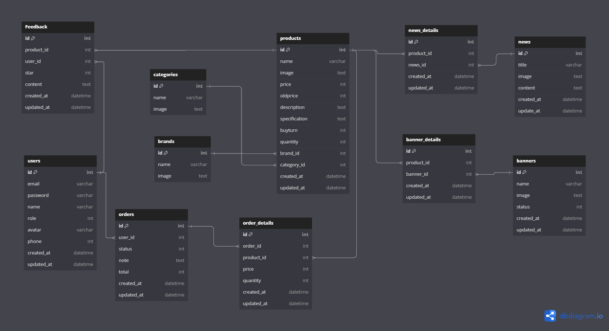

# E-commerce Shop App - A Learning Project

This repository contains the source code for a small e-commerce shop application developed as part of learning experience in software development.

## Project Overview

The project aims to provide hands-on practice in building basic e-commerce features such as:

- [ ] User registration and login
- [ ] Product listing and searching
- [ ] Shopping cart management
- [ ] Order processing
- [ ] Payment gateway integration (not implemented yet)
- [ ] Session management
- [ ] Basic security measures

## Key Features

### Frontend

1. Clean and user-friendly interface for product listing
2. Search functionality by product name or category
3. Product image gallery with thumbnails
4. Shopping cart display with total price
5. Add to cart functionality
6. User profile section (with photo upload)

### Backend

1. RESTful API endpoints for product management
2. Secure login and registration system
3. Payment gateway integration (currently not implemented)
4. Order tracking system

## Technology Stack

The project is built using the following technologies:

- **Frontend**:

  - [x] ReactJS: For building user interface components
  - [x] Joi: For managing state in web applications
  - [x] Bootstrap: For styling and layout
  - [x] Material Icons: For icons

- **Backend**:
  - [x] Node.js: For server-side logic
  - [x] Express.js: For building the web server
  - [x] MySQL: For database storage
  - [x] Sequelize, sequelize: For database interactions

## Installation

To set up the project, follow these steps:

1. Clone the repository:
   ```bash
   git clone https://github.com/VD-Phuc-2k5/Shop-App-Online
   ```
2. Install dependencies
   ```bash
   npm i
   ```
3. Download Docker **https://www.docker.com/products/docker-desktop**
4. Docker Container, phpMyAdmin:

- Diagram database (dbdiagram.io):
  <details>
   <summary>Diagram Design</summary>
     
    ```bash
      Table users {
         id int [pk]
         email varchar
         password varchar
         name varchar
         role int
         avatar varchar
         phone int
         created_at datetime
         updated_at datetime
       }
   
       Table categories {
         id int [pk]
         name varchar
         image text
       }

       Table products {
         id int [pk]
         name varchar
         image text
         price int
         oldprice int
         description text
         specification text
         buyturn int
         quantity int
         brand_id int
         category_id int
         created_at datetime
         updated_at datetime
       }

       Ref: "categories".id < "products".category_id

       Table brands {
         id int [pk]
         name varchar
         image text
       }

       Ref: "brands".id < "products".brand_id

       Table Feedback {
         id int [pk]
         product_id int
         user_id int
         star int
         content text
         created_at datetime
         updated_at datetime
       }

       Ref: "products".id < "Feedback".product_id
       Ref: "users".id < "Feedback".user_id

       Table orders {
         id int [pk]
         user_id int
         status int
         note text
         total int
         created_at datetime
         updated_at datetime
       }

       Ref: "users".id < "orders".user_id

       Table order_details {
         id int [pk]
         order_id int
         product_id int
         price int
         quantity int
         created_at datetime
         updated_at datetime
       }

       Ref: "orders".id < "order_details".order_id

       Table news {
         id int [pk]
         title varchar
         image text
         content text
         created_at datetime
         update_at datetime
       }

       Table news_details {
         id int [pk]
         product_id int
         news_id int
         created_at datetime
         updated_at datetime
       }

       Ref: "news".id < "news_details".news_id
       Ref: "products".id < "news_details".product_id
       Ref: "products".id < "order_details".product_id

       Table banners {
         id int [pk]
         name varchar
         image text
         status int
         created_at datetime
         updated_at datetime
       }

       Table banner_details {
         id int [pk]
         product_id int
         banner_id int
         created_at datetime
         updated_at datetime
       }

       Ref: "products".id < "banner_details".product_id
       Ref: "banners".id < "banner_details".banner_id

</details>



- Run Comnand:
  ```bash
  docker compose -f ./deployments.yml up -d
  ```

# Run Project:
 - Run Docker Desktop
 - Client:
   - Open terminal and run Command:
     ```bash
     npm run dev
     ```
 - Server:
   - Create .env file:
     ```bash
       PORT = 3000
       DATABASE_PORT = 3309
       NODE_ENV = "development"
     ```
   - Open terminal and run Command:
     ```bash
     npm start
     ```

# References
1. [Joi Documentation](https://www.npmjs.com/package/joi)
2. [Node.js Offical Website](https://nodejs.org/)
3. [Express.js Project Page](https://github.com/expressjs/express)
4. [MySQL Offical Website](https://www.mysql.com/)
5. [Docker Desktop Guide](https://docs.docker.com/guides/)


# License

This project is free to use, modify, and distribute under the MIT License.

<!-- ## Migrate (node js - express)

- install mysql2 -> cmd: yarn add mysql2
- install sequelize -> cmd: yarn add sequelize
- install sequelize-cli -> cmd: yarn add sequelize-cli

# Create directory tree

- cmd: npx sequelize-cli init

# Generate model

- cmd: npx sequelize-cli model:generate --name <name> --attributes <x, ...>
- Example: npx sequelize-cli model:generate --name User --attributes email:string, password:string,name:string,role:integer,avatar:string,phone:integer,created_at:date,updated_at:date

# Run Migrations

- cmd: npx sequelize-cli db:migrate

# Undo Migrate

- cmd: npx sequelize-cli db:migrate:undo

- cmd: npx sequelize-cli db:migrate:undo:all

# Check Foreign Key

- jquery: SELECT \* FROM information_schema.table_constraints WHERE table_schema = 'db name' AND table_name = 'table name';

- Ex:
  SELECT \* FROM information_schema.table_constraints WHERE table_schema = 'shopapp_online' AND table_name = 'orders';

# Download babel node

- cmd: yarn add --dev @babel/core @babel/node @babel/preset-env

# mysql_container bash

-cmd : docker exec -it mysql_container bash -->
